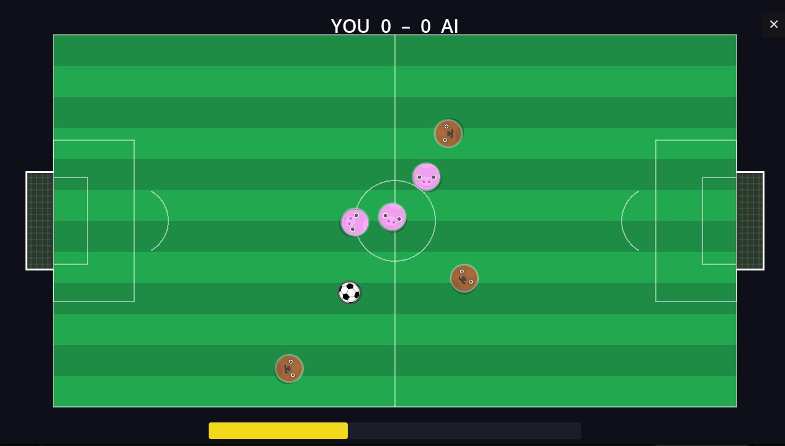

# Shootball

**Penny Football — Reimagined**

A cross-platform multiplayer game built with Godot 4.x where players flick disc-shaped pills across various game fields using slingshot aiming. Play solo against AI or compete online against real opponents with server-authoritative physics.

<p align="center">
  
</p>

## Game Modes

| Mode | Description | Scoring |
|---|---|---|
| **CoinBall** | Flick your pills through a central gate | First to 3 goals |
| **Football** | Push a ball into the opponent's goal | First to 3 goals |
| **Battle Arena** | Knock opponents into gravitational pits | Last team standing (best of 3) |
| **Volleyball** | Smack the ball over the net onto the opponent's side | First to 3 points |
| **Curling** | Slide pills toward the house — closest to the button scores | First to 5 ends |

All five modes support both **solo** (vs AI) and **online** (vs real players) play.

## How to Play

1. **Aim** — Touch or click and drag behind your pill to set direction and power (slingshot style)
2. **Release** — Let go to shoot. In simultaneous modes, both players shoot blind at the same time
3. **Watch** — Physics resolves collisions, bounces, and scoring
4. **Repeat** — Next round begins after all pills settle

## Screenshots

The game features 30 selectable avatars, three AI difficulty levels (Easy / Normal / Hard), and a lobby system for online matchmaking across all five modes.

## Tech Stack

| Component | Technology |
|---|---|
| Game engine | [Godot 4.6](https://godotengine.org/) (GDScript) |
| Multiplayer backend | [Nakama](https://heroiclabs.com/nakama/) open-source game server |
| Server physics | Custom 2D circle physics engine (TypeScript) |
| Networking model | Server-authoritative with client-side trajectory replay |
| Platforms | iOS, Android, Desktop (Windows, macOS, Linux) |

## Project Structure

```
shootball/
├── addons/
│   └── com.heroiclabs.nakama/        # Nakama Godot SDK
├── assets/
│   ├── avatars/                      # 30 player avatars
│   ├── sounds/                       # Music and sound effects
│   └── ...                           # Field textures, ball sprites, UI
├── scenes/                           # 13 Godot scenes (.tscn)
│   ├── main_menu.tscn                # Entry point
│   ├── online_lobby.tscn             # Matchmaking lobby
│   ├── game.tscn                     # Solo CoinBall
│   ├── game_football.tscn            # Solo Football
│   ├── game_online_football.tscn     # Online Football
│   └── ...                           # All 5 solo + 5 online + avatar select
├── scripts/                          # 17 GDScript files
│   ├── constants.gd                  # Shared constants (autoload)
│   ├── online.gd                     # Nakama client wrapper (autoload)
│   ├── pill.gd                       # RigidBody2D game piece
│   ├── ai_player.gd                  # AI opponent (raycast strategy)
│   ├── game_*.gd                     # Solo mode logic (5 files)
│   └── game_online_*.gd              # Online mode logic (5 files)
└── project.godot
```

## Architecture

### Solo Play

The client runs Godot's built-in 2D physics engine locally. An AI opponent selects shots using raycast-based strategy evaluation with three difficulty tiers.

### Online Play

Online matches use a **server-authoritative** model to guarantee identical results for both players:

1. Both players submit shot inputs to the server
2. The server runs a custom 2D physics simulation (circle-circle and circle-wall collisions with damping, bounce, and friction)
3. The server sends back a simulation result containing the full trajectory of all objects frame-by-frame, plus game outcome data (goals, eliminations, scores)
4. Clients replay the trajectory by positioning frozen physics bodies, so both players see identical animations
5. After replay completes, clients send a ready signal and the next round begins

This eliminates desync issues caused by floating-point differences between clients.

## Server

The backend lives in a separate repository: [shootball-server](https://github.com/mamipour/shootball-server)

It runs on Nakama with a custom TypeScript match handler that manages matchmaking, physics simulation, scoring, and game state for all five online modes.

## Getting Started

### Prerequisites

- [Godot 4.6+](https://godotengine.org/download/)
- For online play: a running [shootball-server](https://github.com/mamipour/shootball-server) instance

### Running the Client

1. Clone this repository
2. Open the project in Godot 4.6+
3. Run the main scene (`scenes/main_menu.tscn`)

Solo modes work immediately without a server. For online play, update the server address in `scripts/online.gd` if needed.

### Configuration

| Setting | Location | Default |
|---|---|---|
| Viewport size | `project.godot` | 1280 x 720 |
| AI difficulty | In-game settings | Normal |
| Master volume | In-game settings | 50% |
| Server host | `scripts/online.gd` | `shootball.avardgah.com:7350` |

## Contributing

Contributions are welcome for educational and non-commercial purposes. Feel free to open issues, suggest improvements, or submit pull requests.

## License

This project is licensed under the [CC BY-NC 4.0](LICENSE) (Creative Commons Attribution-NonCommercial 4.0 International) license. You are free to use, share, and adapt this work for non-commercial and educational purposes with appropriate credit. See the [LICENSE](LICENSE) file for details.
